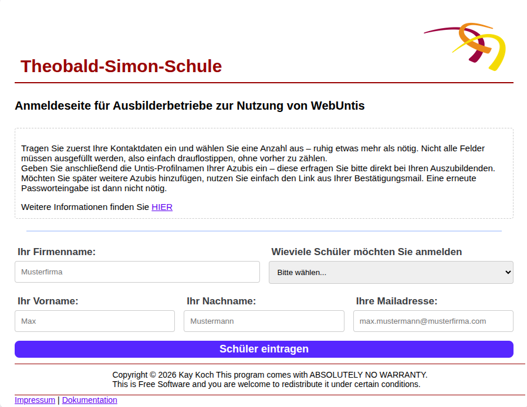

# tss_untisanmeldung
## 

## Einleitung
tss_untisanmeldung ist eine webbasierte Anwendung zur Verwaltung von Untis-Anmeldungen.

Damit Ausbilder Zugang zu WebUntis erhalten, müssen sie in Untis registriert werden.
Diese Applikation stellt Ihnen die Möglichkeit zur Verfügung, ihre eigenen Schüler mit ihren Daten
zu verknüpfen. Ihre Daten werden in einer Datenbank gespeichert, und können als CSV-Datei 
export werden. Die Datei kann direkt in Untis importiert werden. Die Ausbilder können
anschließend darüber informiert werden.

Das Setup-Skript richtet automatisch eine virtuelle Python-Umgebung ein, installiert
alle Abhängigkeiten und generiert kryptografische Schlüssel für den Betrieb.

___

# Inhaltsverzeichnis
- [Voraussetzungen](#voraussetzungen)
- [Installation](#installation)
- [Programmstart](#programmstart)
  - [Variante 1 – Direkt mit Python (Lokal)](#variante-1--direkt-mit-python-lokal)
  - [Variante 2 – Gunicorn (Servertest)](#variante-2--gunicorn-servertest)
  - [Variante 3 – systemd (Produktion)](#variante-3--systemd-produktion)
- [Stoppen der Anwendung](#stoppen-der-anwendung)
- [Hinweise zur Sicherheit](#hinweise-zur-sicherheit)
- [Dokumentation](#dokumentation)

___

# Voraussetzungen

Auf dem Server muss Python 3 (>= 3.11), python3-venv und git installiert sein:

    apt install python3 python3-venv git

___

# Installation

## Verzeichnis erstellen und Projekt herunterladen

Wähle die Zeilen entsprechend, ob du Variante 1 (lokal zum Testen) oder
Variante 2/3 (auf einem Server als root) einrichten möchtest.

> Im Beispiel: INSTALLATIONSVERZEICHNIS := /var/www/tss_untisanmeldung/

    # Basisverzeichnis erstellen
    mkdir ~/www/                        # Variante 1 – Lokal
    mkdir -p /var/www/                  # Variante 2/3 – Server

    # In das Verzeichnis wechseln
    cd ~/www/                           # Variante 1 – Lokal
    cd /var/www/                        # Variante 2/3 – Server

    # Projekt herunterladen
    git clone https://github.com/kaykoch/tss_untisanmeldung.git

    # In das Projektverzeichnis wechseln
    cd tss_untisanmeldung/

    # Setup-Skript ausführbar machen und starten
    chmod +x ./setup.py
    ./setup.py

## Was setup.py macht

- Prüft die Python-Version (>= 3.11)
- Prüft, ob der Systembenutzer `www-data` existiert (nur Linux, Warnung bei Fehlen)
- Erstellt eine virtuelle Umgebung unter `.venv/`
- Generiert eine `.env`-Datei mit kryptografischen Schlüsseln
- Installiert alle Abhängigkeiten aus `requirements.txt`
- Setzt die Verzeichnisberechtigungen auf `www-data:www-data` (nur Linux, benötigt sudo)

> Für Variante 2/3 (Server) muss setup.py mit sudo ausgeführt werden,
> damit die Berechtigungen korrekt gesetzt werden können:
>
>     sudo ./setup.py

___
## Weitere Anpassungen

### Texte auf der Webseite
- Seiten, die den Ausbildern angezeigt werden, beinhalten Informationen die in einer spezielen Datei angepasst werden können. -> "src/data/texts.toml"
- Texte auf den Adminseiten müssen in den entsprechenden Templates geändert werden -> "src/templates/admin"
- Texte in den Mails werden müssen in den entsprechenden Templates geändert werden -> "src/templates/mail"
### Logo und favicon
- Das Logo und das favicon.ico kann im static Ordner geändert werden -> "src/static"
- Eine Dokumentation kann im static Ordner geändert werden -> "src/static"

# Programmstart

## Variante 1 – Direkt mit Python (Lokal)

Geeignet für: Lokale Entwicklung und schnelle Tests.

    source .venv/bin/activate
    python untis.py

Risiken:
- Läuft im Flask-Entwicklungsserver — nicht produktionstauglich
- debug=True gibt Stacktraces im Browser aus
- Kein automatischer Neustart bei Absturz
- Kein Load-Balancing / mehrere Worker

___

## Variante 2 – Gunicorn (Servertest)

Geeignet für: Tests auf dem Server ohne systemd.

    # Starten
    python deploy/startGunicorn.py

    # Stoppen
    python deploy/startGunicorn.py kill

Risiken:
- Läuft auf Port 8081 und ist unter 0.0.0.0 von außen erreichbar
- Kein automatischer Neustart bei Absturz oder Serverneustart
- Logs landen unter /tmp/ — gehen bei Serverneustart verloren
- Nur für Tests gedacht — nicht für den Dauerbetrieb

___

## Variante 3 – systemd (Produktion)

Geeignet für: Dauerhafter Betrieb auf einem Linux-Server.

### Einmalige Einrichtung

    sudo cp deploy/tss_untisanmeldung.service /etc/systemd/system/
    sudo systemctl daemon-reload
    sudo systemctl enable tss_untisanmeldung

### Starten / Stoppen / Status

    sudo systemctl start tss_untisanmeldung
    sudo systemctl stop tss_untisanmeldung
    sudo systemctl status tss_untisanmeldung

### Logs anzeigen

    sudo journalctl -u tss_untisanmeldung -f

Hinweise:
- Läuft auf Port 8082 unter Benutzer www-data
- Startet automatisch nach einem Serverneustart
- Automatischer Neustart bei Absturz
- Pfade in der .service-Datei ggf. anpassen

___

# Stoppen der Anwendung

| Variante                  | Befehl                                          |
|---------------------------|-------------------------------------------------|
| Variante 1 (Python direkt)| STRG + C im Terminal                            |
| Variante 2 (Gunicorn)     | python deploy/startGunicorn.py kill             |
| Variante 3 (systemd)      | sudo systemctl stop tss_untisanmeldung          |

___

# Hinweise zur Sicherheit

- Die .env-Datei enthält kryptografische Schlüssel — niemals in git einchecken
- .env ist in .gitignore eingetragen und wird nicht hochgeladen
- Für den Produktiveinsatz ausschließlich Variante 3 (systemd) verwenden
- Der Gunicorn-Start (Variante 2) ist nur im lokalen Netz für Testzwecke gedacht
- Stelle sicher, dass Port 8082 durch eine Firewall oder einen Reverse Proxy (z.B. nginx) abgesichert ist

___

# Verzeichnisstruktur

    tss_untisanmeldung/
    ├── deploy/
    │   ├── startGunicorn.py              # Manueller Gunicorn-Start/-Stop
        ├── tss_untisanmeldung.service    # systemd-Unit für Produktionsbetrieb
    │   └── README.md                     # Infodatei (Startmöglichkeiten)
    ├── logs                              # Logdatei
    ├── src/                              # Anwendungsquellcode
    ├── .env                              # Generierte Schlüssel
    ├── requirements.txt                  # Bibliotheken für .venv
    ├── README.md                         # Infodatei (Allgemein)
    ├── ruff.toml                         # Editor Settings für VSCodium (Nicht nötig für Betrieb)
    ├── setup.py                          # Einrichtungsskript
    └── untis.py                          # Einstiegspunkt der Anwendung
 
    
# Dokumentation
Eine Dokumentation befindet sich [Hier](./src/static/Dokumentation.pdf)
